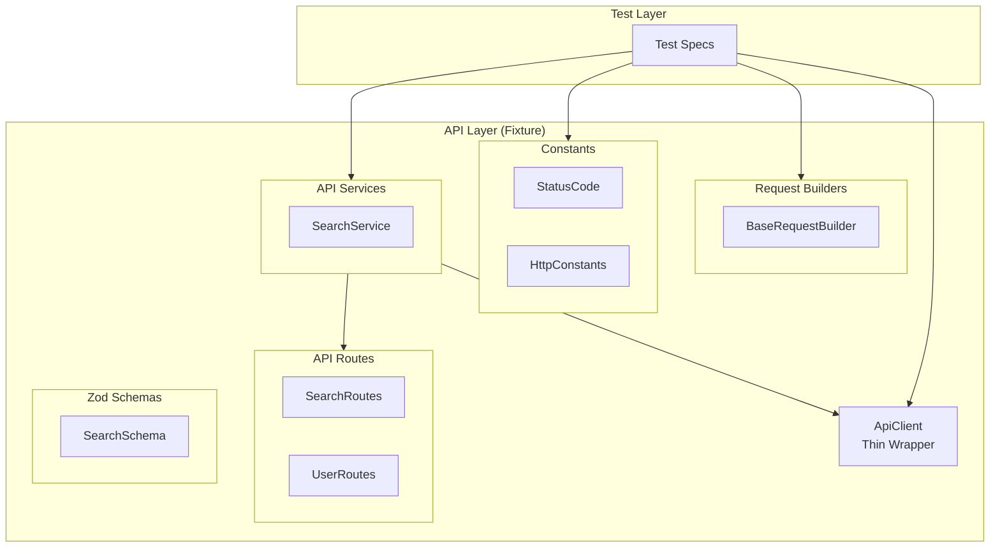

# API Utilities Pattern

Utilities for REST API operations in Playwright tests using Spec-Driven Development.

---

## Architecture



| Layer | Location | Purpose |
|-------|----------|---------|
| **ApiClient** | `utils/ApiClient.ts` | Thin wrapper around Playwright's `APIRequestContext` |
| **Builders** | `tests/api/builders/` | Type-safe request payload builders |
| **Constants** | `tests/api/constants/` | HTTP status codes, headers, content types |
| **Routes** | `tests/api/routes/*Routes.ts` | Centralized endpoint definitions |
| **Schemas** | `tests/api/schemas/*Schema.ts` | Zod schemas for response validation |
| **Services** | `tests/api/services/*Service.ts` | Domain-specific API calls (returns raw JSON) |
| **Fixture** | `tests/fixtures/api.fixture.ts` | Exposes `apiClient` + services |

---

## API Routes Documentation

**Rule:** All API route files must follow this documentation pattern:

**✅ DO:**
- Add file-level JSDoc comment with API name and `@see` link to API documentation
- Add inline JSDoc comment for each route constant describing its purpose
- Use `as const` for route objects to ensure type safety

**❌ DON'T:**
- Skip file-level documentation
- Omit `@see` links to API documentation
- Leave route constants without descriptions

**Example:**

```typescript
// ✅ GOOD: File-level doc with @see and inline route comments
/**
 * Wikipedia Search API Routes
 * @see https://api.wikimedia.org/wiki/Core_REST_API
 */
export const SearchRoutes = {
    /** Search pages by content */
    SEARCH_PAGE: '/search/page',

    /** Search pages by title only */
    SEARCH_TITLE: '/search/title',

    /** Autocomplete suggestions */
    SEARCH_AUTOCOMPLETE: '/search/autocomplete',
} as const;

// ❌ BAD: Missing documentation
export const SearchRoutes = {
    SEARCH_PAGE: '/search/page',
    SEARCH_TITLE: '/search/title',
} as const;
```

---

## Components

### ApiClient (Thin Wrapper)

Mirrors Playwright's `APIRequestContext` methods exactly, only adding base URL handling:

```typescript
import { ApiClient } from '@utils/api-client';
import { StatusCode } from '@api';

// Same signature as request.get(), returns native APIResponse
const response = await apiClient.get('/search/page', {
    params: { q: 'earth', limit: 10 }
});

const data = await response.json();
expect(response.status()).toBe(StatusCode.OK);
```

### 3. API Services (`tests/api/services/`)

Domain-specific logic.

**Rules**:
1.  **Return Raw `APIResponse`**: Never return parsed JSON. Allow tests to access headers/status.
2.  **No Assertions**: Services should only fetch data. Validation happens in tests.
3.  **Use Routes**: Use `tests/api/routes` for endpoints.
4.  **Export from Barrel**: All services must be exported from `tests/api/services/index.ts`.
5.  **🔴 Single Class Per File**: Do not create multiple classes in one API service file. Consolidate related methods into a single class.
6.  **🔴 Request Models for Structures**: Use request builder classes (extending `BaseRequestBuilder`) for form data, query parameters, and request bodies. Never hardcode request structures inline.
7.  **🔴 Constants for Parameters**: Extract all hardcoded API parameter values (actions, formats, types, etc.) to constants files in `tests/api/constants/`. Use constants instead of magic strings.
8.  **🔴 Authentication in AuthService**: All authentication-related methods (OAuth tokens, CSRF tokens, etc.) belong in `AuthService`, not in domain-specific services.
9.  **🔴 No Unused Methods**: Never create API service methods that are not used in tests. Remove unused methods immediately.
10. **🔴 JSDoc on All Methods**: All public methods in API services must have JSDoc comments describing what they do.

```typescript
// tests/api/services/UserService.ts
import { APIResponse } from '@playwright/test';
import { ApiClient } from '@utils/api-client';
import { UserRoutes } from '@api/routes';

export class UserService {
    constructor(private apiClient: ApiClient) {}

    async createUser(payload: object): Promise<APIResponse> {
        return this.apiClient.post(UserRoutes.CREATE, { data: payload });
    }

    async getUser(id: string): Promise<APIResponse> {
        return this.apiClient.get(UserRoutes.GET(id));
    }
}
```

### 4. Zod Validation in Tests (`tests/specs/`)
 
 Validation happens at the test level using the `assertSchema` helper, which parses the response and handles assertions automatically.
 
 **🔴 CRITICAL RULE:** Always use `assertSchema()` - never bypass with `response.json()`
 
 **Validation Flow (always follow this order):**
 1. **Status Code Validation** (always first)
 2. **Schema Validation** (structure and types) - **Always use `assertSchema()`**
 3. **Business Logic Validation** (specific assertions)
 
 ```typescript
 // tests/specs/user-api.spec.ts
 import { assertSchema } from '@utils/parse-response';
 import { UserSchema } from '@api/schemas';
 
 test('create user', async ({ userService }) => {
     // 1. Get raw response
     const response = await userService.createUser({ name: 'John' });
     
     // 2. Validate status code (always first)
     await expect(response).toHaveStatusCode(StatusCode.CREATED);
 
     // 3. Validate schema (structure and types) - ALWAYS use assertSchema!
     const data = await assertSchema(response, UserSchema, 'User Creation Response');
     
     // 4. Verify business logic (specific assertions)
     expect(data.name, 'Created user name should match input').toBe('John');
 });
 ```

 **❌ WRONG: Bypassing schema validation**
 ```typescript
 // DON'T DO THIS - bypasses validation
 const authResponse = await authService.getAccessToken();
 const authData = await authResponse.json();  // NO! No type safety, no validation
 ```

 **✅ CORRECT: Using assertSchema**
 ```typescript
 // ALWAYS DO THIS
 const authResponse = await authService.getAccessToken();
 const authData = await assertSchema(authResponse, AccessTokenSchema, 'Access Token');
 ```

### 5. Assertion Rules
 
 **Prohibited**: Generic assertions without messages.
 **Required**: Use custom matchers or explicit error messages.
 
 #### Custom Matchers
 
 We use custom Playwright matchers for common API assertions.
 
 ```typescript
 // ✅ Good (Custom Matcher)
 await expect(response).toHaveStatusCode(StatusCode.OK);
 
 // ✅ Good (Explicit Message)
 expect(result.pages, 'Search results should contain 10 items').toHaveLength(10);
 
 // ❌ Bad (Generic)
 expect(response.status()).toBe(200);
 ```

### Request Builders

Build complex payloads with the Builder pattern. Extend `BaseRequestBuilder` to create type-safe request builders for specific endpoints.

**🔴 MANDATORY: Use Request Builders for:**
- Form data structures (POST/PUT requests)
- Query parameter objects
- Request body structures
- Any structured request data

**Base Class**: `BaseRequestBuilder<T>` provides:
- `with(overrides)` - Apply overrides to the model
- `delete(field)` - Remove a field from the model
- `clone()` - Create a copy of the builder
- `build()` - Return the final payload

**Pattern**: Create a builder class with a static method that builds the request model:

```typescript
export class CreatePageRequestModel extends BaseRequestBuilder<CreatePageRequest> {
    static buildCreatePageRequestModel(
        title: string,
        content: string,
        csrfToken: string,
        summary?: string
    ): Partial<CreatePageRequest> {
        return new CreatePageRequestModel()
            .with({
                title,
                text: content,
                token: csrfToken,
                summary: summary ?? 'Automated test page creation',
                createonly: MediaWikiEditOption.CREATE_ONLY
            }).build();
    }
}
```

**Example Usage**:

```typescript
import { BaseRequestBuilder } from '@api/builders';

// Define a specific builder
interface CreateUserRequest {
    name: string;
    email: string;
    role?: string;
}

class CreateUserBuilder extends BaseRequestBuilder<CreateUserRequest> {
    constructor() {
        super({ role: 'user' }); // default values
    }
    
    withName(name: string) { 
        return this.with({ name }); 
    }
    
    withEmail(email: string) { 
        return this.with({ email }); 
    }
}

// Usage in tests
const payload = new CreateUserBuilder()
    .withName('John')
    .withEmail('john@test.com')
    .build();
```

**❌ BAD: Hardcoded request structures**
```typescript
// DON'T DO THIS - hardcoded structure
return this.client.post(MediaWikiActionRoutes.API, {
    params: {
        action: 'edit',
        format: 'json'
    },
    form: {
        title,
        text: content,
        token: csrfToken,
        summary: summary ?? 'Automated test page creation',
        createonly: '1'
    }
});
```

**✅ GOOD: Using request builders and constants**
```typescript
// DO THIS - use builders and constants
const formData = CreatePageRequestModel.buildCreatePageRequestModel(
    title,
    content,
    csrfToken,
    summary
);
const queryParams = EditPageQueryParamsModel.buildQueryParams();

return this.client.post(MediaWikiActionRoutes.API, {
    params: queryParams,
    form: formData
});
```

### API Constants

**🔴 MANDATORY: Extract all API parameter values to constants**

All hardcoded API parameter values must be extracted to constants files in `tests/api/constants/`:

**When to Create Constants:**
- API actions (e.g., `'query'`, `'edit'`)
- Response formats (e.g., `'json'`)
- Meta parameters (e.g., `'tokens'`)
- Token types (e.g., `'csrf'`)
- Operation options (e.g., `'1'` for createonly)

**Pattern**: Create domain-specific constants files (e.g., `MediaWikiConstants.ts`):

```typescript
export const MediaWikiAction = {
    QUERY: 'query',
    EDIT: 'edit',
} as const;

export const MediaWikiFormat = {
    JSON: 'json',
} as const;

export const MediaWikiMeta = {
    TOKENS: 'tokens',
} as const;

export const MediaWikiTokenType = {
    CSRF: 'csrf',
} as const;

export const MediaWikiEditOption = {
    CREATE_ONLY: '1',
} as const;
```

**Usage in Request Builders:**
```typescript
import { MediaWikiAction, MediaWikiFormat, MediaWikiEditOption } from '@api/constants';

static buildQueryParams(): Partial<EditPageQueryParams> {
    return new EditPageQueryParamsModel()
        .with({
            action: MediaWikiAction.EDIT,
            format: MediaWikiFormat.JSON
        }).build();
}
```

**❌ BAD: Hardcoded parameter values**
```typescript
.with({
    action: 'edit',
    format: 'json',
    createonly: '1'
})
```

**✅ GOOD: Using constants**
```typescript
.with({
    action: MediaWikiAction.EDIT,
    format: MediaWikiFormat.JSON,
    createonly: MediaWikiEditOption.CREATE_ONLY
})
```

### 6. Discovering API Endpoints

When automating test cases that require API operations (e.g., creating test data via API, then verifying via UI), you need to discover available API endpoints.

**Process for Finding API Endpoints:**

1. **Check Official API Documentation** - Always start with the official API documentation
2. **Review Existing Routes** - Check existing route files in `tests/api/routes/` for patterns
3. **Search API Documentation** - Use web search to find specific endpoint documentation
4. **Verify Endpoint Availability** - Test endpoints before implementing them (see Endpoint Validation)

**Wikipedia API Documentation Sources:**

For Wikipedia/Wikimedia APIs, use these documentation sources:

- **Core REST API** - Primary REST API for Wikipedia
  - Main Documentation: https://api.wikimedia.org/wiki/Core_REST_API
  - Base URL Pattern: `https://api.wikimedia.org/core/v1/{project}/{language}/`
  - Example: `https://api.wikimedia.org/core/v1/wikipedia/en/`

- **REST API Reference** - Detailed endpoint documentation
  - Edit Page: https://api.wikimedia.org/wiki/Core_REST_API/Reference/Pages/Edit_page
  - Search: https://api.wikimedia.org/wiki/Core_REST_API/Reference/Search
  - Authentication: https://api.wikimedia.org/wiki/Getting_started_with_Wikimedia_APIs

- **MediaWiki Action API** (Alternative) - Older API format
  - Documentation: https://www.mediawiki.org/wiki/API:Main_page
  - Base URL: `https://en.wikipedia.org/w/api.php`
  - Example: `action=edit` for editing pages

**Example: Discovering Page Creation Endpoint**

When asked to automate "API page creation and UI assertion", follow this process:

1. **Search Documentation**: Search for "Wikipedia API create page" or "Wikipedia API edit page"
2. **Identify Endpoint Type**: Determine if REST API or Action API is needed
   - REST API: `PUT /core/v1/{project}/{language}/page/{title}`
   - Action API: `POST /w/api.php?action=edit`
3. **Check Existing Routes**: Review `tests/api/routes/PageRoutes.ts` for similar patterns
4. **Verify Authentication Requirements**: Check if OAuth is required (most write operations do)
5. **Document in Routes File**: Add endpoint to appropriate routes file with `@see` link

**Key Endpoints for Common Operations:**

| Operation | REST API Endpoint | HTTP Method | Auth Required |
|-----------|------------------|-------------|---------------|
| Create/Edit Page | `/page/{title}` | PUT | Yes (OAuth) |
| Get Page Content | `/page/{title}/bare` | GET | No (optional) |
| Search Pages | `/search/page` | GET | No |
| Search Titles | `/search/title` | GET | No |

**Documentation Pattern:**

When adding new routes, always include:
- File-level JSDoc with `@see` link to API documentation
- Inline comments describing endpoint purpose
- Authentication requirements in comments

```typescript
/**
 * Wikipedia Page API Routes
 * @see https://api.wikimedia.org/wiki/Core_REST_API/Reference/Pages/Edit_page
 */
export const PageRoutes = {
    /** Get page content in bare format */
    GET_BARE: (title: string) => `/page/${title}/bare`,
    
    /** Create or edit a page (requires OAuth authentication) */
    EDIT_PAGE: (title: string) => `/page/${title}`,
} as const;
```

### 7. Endpoint Validation

**✅ DO:**
- Verify endpoints exist before writing tests
- Remove tests for non-existent endpoints
- Document endpoint availability

**❌ DON'T:**
- Write tests for endpoints that don't exist
- Keep failing tests for invalid endpoints (404 errors)

**Endpoint Validation Process:**

1. **Check API Documentation** - Verify endpoint exists
2. **Test Endpoint** - Make a test request
3. **If 404/Not Found** - Remove test or use alternative endpoint
4. **Update Routes** - Remove invalid routes from routes file

**Example:**
```typescript
// ❌ BAD: Test for non-existent endpoint
test('Verify autocomplete returns suggestions', async ({ searchService }) => {
    const response = await searchService.autocomplete('test');
    await expect(response).toHaveStatusCode(StatusCode.OK); // Will fail with 404
});

// ✅ GOOD: Remove test if endpoint doesn't exist
// Or use alternative endpoint that exists
test('Verify search returns suggestions', async ({ searchService }) => {
    const response = await searchService.search('test');
    await expect(response).toHaveStatusCode(StatusCode.OK);
});
```

**Route Cleanup:**
When removing tests for non-existent endpoints:
1. Remove test from spec file
2. Remove route from routes file (if not used elsewhere)
3. Remove service method (if only used by removed test)

---

## Usage Patterns

### Pattern 1: Using SearchService in Tests

```typescript
import { test, expect } from '@fixtures/api.fixture';

test('search via API', async ({ searchService }) => {
    const results = await searchService.search('JavaScript');
    expect(results.pages.length).toBeGreaterThan(0);
});
```

### Pattern 2: Using Constants

```typescript
import { StatusCode } from '@api/constants';

const response = await apiClient.get('/users');
await expect(response).toHaveStatusCode(StatusCode.OK);
```

---

## Environment Configuration

API URL is configured per environment in `tests/data/environment/{env}.json`:

```json
{
    "api": {
        "apiUrl": "https://api.wikimedia.org/core/v1/wikipedia/en"
    }
}
```

---

## Files Reference

| File | Description |
|------|-------------|
| [ApiClient.ts](file:///c:/Users/m.novikov/Desktop/Playwright-SSD/Playwright-SDD/utils/ApiClient.ts) | Thin HTTP wrapper |
| [BaseRequestBuilder.ts](file:///c:/Users/m.novikov/Desktop/Playwright-SSD/Playwright-SDD/tests/api/builders/BaseRequestBuilder.ts) | Base builder class |
| [StatusCode.ts](file:///c:/Users/m.novikov/Desktop/Playwright-SSD/Playwright-SDD/tests/api/constants/StatusCode.ts) | HTTP status codes |
| [api.fixture.ts](file:///c:/Users/m.novikov/Desktop/Playwright-SSD/Playwright-SDD/tests/fixtures/api.fixture.ts) | API fixtures |
| [parseResponse.ts](file:///c:/Users/m.novikov/Desktop/Playwright-SSD/Playwright-SDD/utils/parseResponse.ts) | Schema validation helpers |
| [matchers.ts](file:///c:/Users/m.novikov/Desktop/Playwright-SSD/Playwright-SDD/utils/matchers.ts) | Custom Playwright matchers |
